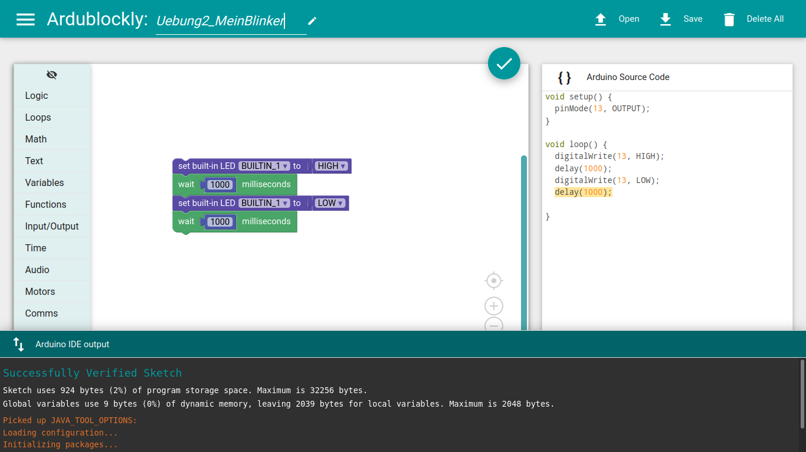

# Ardublockly
Ardublockly is a visual programming editor for Arduino. It is based on Google's [Blockly][1], which has been forked to generate [Arduino][15] code.

The `ArdublocklyServer` Python package initialises a local server to be able to compile and load the Arduino code using the [Arduino IDE](https://www.arduino.cc/en/Main/Software_)).

Therefore, it is executable on most OS including Linux, Mac, Windows, and Android (limited).

This version focuses on the ArdublocklyServer version of [ArduBlockly](https://github.com/carlosperate/ardublockly) developed by [Carlos Pereira Atencio](https://www.embeddedlog.com/)



## Features
* Generates Arduino code with visual drag-and-drop blocks
* Uploads the code to an Arduino Board
* Useful "code block warnings"
* Compatible with a wide range of official Arduino Boards
* Works on Windows / Linux / Mac OS X / Android (limited)

Ardublockly is still under development and a few features are not yet implemented.

Currently tested under Windows with Python 2.7 and 3.4 and in Linux and MacOS X with Python 2.7.

## Cloning the repository
Please note that there are submodules in the repository that need initialisation. So, to correctly clone the Ardublockly repository:

```
git clone https://gitlab.com/DigitalStages/ardublockly.git
cd ardublockly
git submodule update --init --recursive
```


## Installing
1. Install Python 3
2. Install Arduino IDE (You will also need the [Arduino IDE version 1.6.x or higher][2])
3. Install [libraries](https://gitlab.com/DigitalStages/ardublockly_arduino4kids/-/tree/main/files/arduino_libraries) in Arduino necessary to use all blocks of this version of ArduBlockly
4. Clone this repository, initialise all submodules, and execute:
```
python3 start.py
```
5. This will load the web interface on your local browser.

This will work on Windows, Linux (including ARM), Mac OS X, with Python >2.7 or >3.4

## Installing on Android

To make it work on a Arduino device, you will need to install
1. [ArduinoDroid Software](https://play.google.com/store/apps/details?id=name.antonsmirnov.android.arduinodroid2)
2. [QPython 3L - Python](https://play.google.com/store/apps/details?id=org.qpython.qpy3)
3. [File Manager](https://play.google.com/store/apps/details?id=com.alphainventor.filemanager)

The limitation comes with uploading Blockly codes to the Arduino board. First you will need to save ArduBlockly blocks as .ino file, and upload this file to the Arduino board via ArduinoDroid.


## Credit
This project has been inspired by [ArduBlockly](https://github.com/carlosperate/ardublockly) developed by [Carlos Pereira Atencio](https://www.embeddedlog.com/).

Blockly original source is Copyright of [Google Inc.](https://developers.google.com/blockly/).

## License
Unless stated otherwise, the source code of this projects is
licensed under the Apache License, Version 2.0 (the "License");
you may not use any of the licensed files within this project
except in compliance with the License.

The full document can be found in the [LICENSE](https://gitlab.com/DigitalStages/ardublockly/-/blob/main/LICENSE) file.

Unless required by applicable law or agreed to in writing, software
distributed under the License is distributed on an "AS IS" BASIS,
WITHOUT WARRANTIES OR CONDITIONS OF ANY KIND, either express or implied.
See the License for the specific language governing permissions and
limitations under the License.
